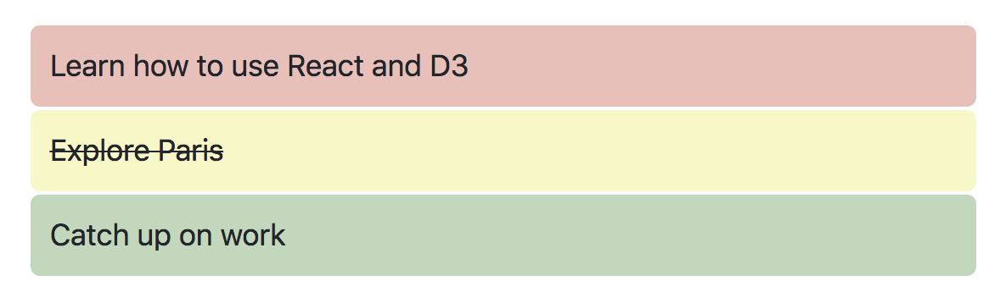

# 04-react-intro-exercise
In this exercise, you'll follow the instructions below to build a simple _todo list_ that looks like this:


In doing so, you'll create and render two react components. See the solution in the `solution.js` file. 

## Instructions
The necessary CSS and HTML code are already written for you in this exercise. You'll also notice that there is an array of objects storing the _todo_ items that you'll render. In your `main.js` file, complete the following steps:

### `Todo` Component
Define a new component called `Todo` by _extending_ the `React.Component` class. The component should accept the following information as _props_:

- `description`: A _description_ of the task
- `status`: The _status_ of the task (_complete_, or _incomplete_)
- `priority`: The _priority_ of the task (_low_, _medium_, or _high_)

In the components `render()` method, **return** the following (note: in React, you have to specify the `className` property of an HTML element, because `class` is a protected word):

- A `<div>` that has two classes: "todo", and whatever the _priority_ is (which is passed in via _props_)
- Inside the `<div>`, return a paragraph (`<p>`) who class name is equal to the _status_. The text of the paragraph should be the _description_ passed in via props

Rather than rendering an item directly to the DOM, you will use this component _inside_ the `TodoList` component, described below. 

### `TodoList` Component
Define another new component called `TodoList` by _extending_ the `React.Component` class. The component should accept the following information as _props_:

- `list`: A _list_ of todo items (i.e., the ones stored in the `todos` constant)

You will iterate through this list of items, which you can do using the following syntax (assigning a `key` so that React can easily track new/old elements on the DOM):

```
<div>
    {someArray.map((d, i) => {
        return <div key={i}>Some element</div>
    })}
</div>
```

In the components `render()` method, return the following:

- A `<div>` that will contain other elements (remenber: you can only return **one element** in the `render()` method!)
- Inside the `<div>`, iterae through the _list_ that was passed in via _props_. For each element in the array, render a `<Todo>` component, making sure to pass in the appropriate properties. 


### Rendering the list
To render your `<TodoList>` component, use the `ReactDOM.render()` method. Make sure to specify the `list` property of the `<TodoList>` component, and render the list inside the DOM element with id `root`. 