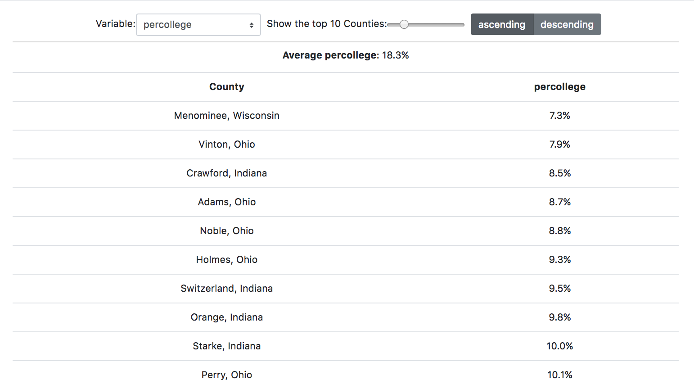

# 06-state-exercise
In this exercise, you'll follow the instructions below to build a data exploration tool in React:



In doing so, you'll **manage the state** of a React component that you create. See the solution in the `solution.js` file.

## Instructions
The necessary CSS and HTML code are already written for you in this exercise, as is _some of_ the JavaScript code. In your `App.js` file, complete the following steps:

### `componentDidMount()` Method
When the component mounts, use the `d3.csv()` method to load the `.csv` file stored in `"data/midwest.csv"`. In the callback function for the method (i.e., once you load the data), **update the state** such that the `data` property (i.e., `this.state.data`) is equal to the data loaded by `d3.csv()`. Make sure to use the `this.setState()` method (don't try to set the value of the state directly). This will trigger a re-rendering of your `App` component. To see if it worked, you can add a `console.log()` statement to the `render()` method to see the state of your component.


### `render()` Method
In the `render()` method, you will first compute some values of interest that you want to display, then you will _return_ an HTML element that contains the information you wish to render on the DOM.

#### Computing values in your `render()` method
It's fairly common to use the state of your component to determine what you wish to render. One challenge to note is that, when the component first renders (but _before_ the data is loaded), your data will be an empty array. This makes it difficult to compute values of interest. Luckily, it's easy to use a **ternary operator** to conditionally capture information of interest:

```javascript
// Use a ternary operator to capture information of interest
// If the data hasn't loaded, return an empty array.
// Otherwise, get the keys of the first data element
let options = this.state.data.length === 0 ? [] : Object.keys(this.state.data[0]);
```

You'll need to store the following information in variables (you can obviously call them whatever you want, but these are the variable names in the `solution.js` file):

- `options`: Create a variable `options` storing the list of possible variables to display in the table (these are the columns in your `.csv` file). These should be the **object keys** from the first element in your data (see above), excluding "county" and "state".
- `allData`: Create a variable `allData` in which you store the current values of interest (based on `this.state.variable`), as well as the state and county. In other words, this should be an **array of objects** with three keys: `value` (the _value_ of whatever is stored in the `this.state.variable` key), `state`, and `county`.
- `mean`: Store the _mean_ of the `value` key in your `allData` array in a variable `mean`. I suggest using `d3.mean()` to do this.
- `topData`: Store the top N values (based on `this.state.nShow`) from the `allData` array in a variable. Observations should be sorted by the current variable being displayed (`this.state.variable`) in either ascending or descending order (based on `this.state.sort`). You can do this using the array methods `.sort()` and `.filter()` (in that order).

#### Returning elements in your `render()` method
There is already a DOM element returned by the `render()` method. Inside that node, you'll create the following elements. Note, because the `ReactDOM.render()` method is being called, you should be able to see your changes appear as you make them. 

___Controls___
- **Select Menu**: Create a Select Menu (i.e., `<select>`) to determine which variable is shown in the table. You can iterate through the `options` array you created above to create each `<option>` _inside_ of your `<select>` element. Assign an `onChange()` method to the `<select>` element such that, whenever the value changes, the value stored in `this.state.variable` updates. Make sure to use the `this.setState()` method to assert this change.
- **Slider**: Create a Slider (i.e., `<input type="slider">`) to control how many rows are shown in the table. The _value_ of the slider should be `this.state.nShow`. When the slider updates (i.e., `onChange()`), you should use the `this.setState()` method to change the state of the `nShow` value. This will change the number of values stored in `topData`, updating the table you will render (described below).
- **Button Group**: Create a Button Group (i.e., a `<div>` with two `<button>` elements) to control if rows in the table are shown in ascending or descending order. I suggest you iterate through an array `["ascending", "descending"]`, and for each element in the array, return a `<button>` element. When the button is clicked (i.e., `onClick()`) you should use `this.setState()` to update the state of the `this.state.sort`. You can also assign an additional className of `"active"` _if_ `this.state.sort` is equal to the value (i.e., ascending, descending). You can do this using an _inline ternary operator_ (i.e., `className={"btn btn-secondary " + (this.state.sort == d ? "active" : "")}`)

These controls will dictate the rendering of the visual elements described below.

___Visual elements___
- **Average value**: Display the average value (`mean`) in a paragraph element (`<p>`).
- **Table**: Show a table (literally, a `<table>`) of the top N counties (based on `this.state.nShow`). The table should have two columns: one displaying the **County**, and the other displaying the **variable of interest**. To do this, you can create two column headers (`<th>`) in a table row (`<tr>`), then iterate through the data stored in `topData`, returning a table row for each element in the array. In the table row, you should have one cell (`<td>`) displaying the county, and the other cell displaying the value of the variable of interest for that county. To make it look nice, you can use the `.toFixed()` method to fix the number of decimals shown in the number.
