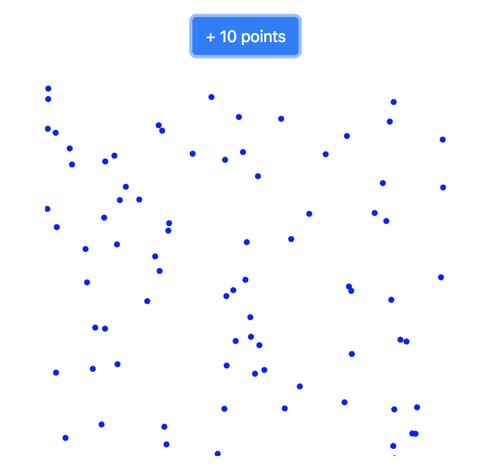

# 05-state-demo
This project uses D3 to draw data on a DOM node that is rendered by a React component. It uses a React component's state to track the number of circles to render, and then draws them in a `<g>` element using D3 whenever the state changes:

