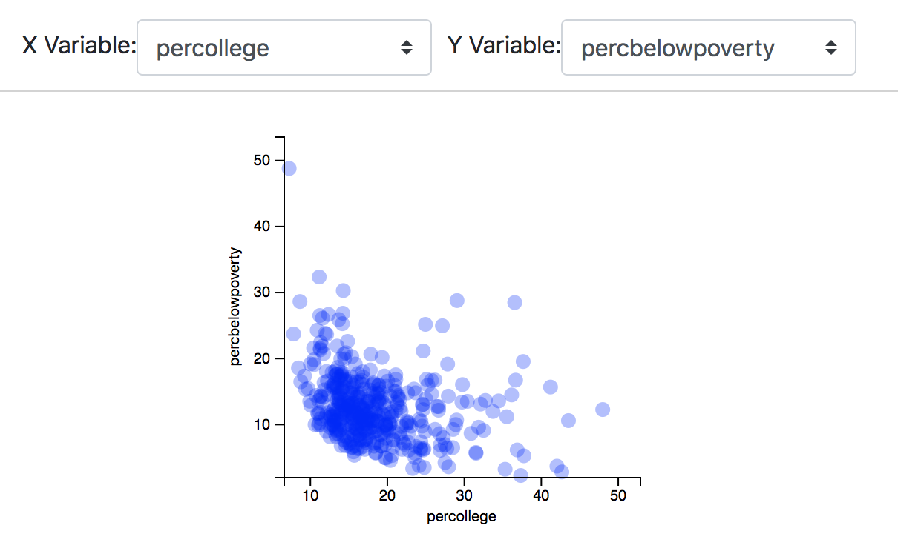

# 08-scatter-exercise
In this exercise, you'll follow the instructions below to build an interactive scatterplot in React:



In doing so, you'll create a React `<ScatterPlot>` component in the `ScatterPlot.js` file. The component that you create will be rendered by your `<App>` component created in the `App.js` file. See the complete code in the `ScatterPlot_solution.js` and `App_solution.js` files.

## Instructions
The necessary CSS and HTML code are already written for you in this exercise, as is _some of_ the JavaScript code. The current structure of the application has an `<App>` component rendering a `<ScatterPlot>` component, each defined in their respective files. You'll need to edit _both files_ to complete this exercises.

### The `<ScatterPlot>` Component
The `<ScatterPlot>` component, defined in `ScatterPlot.js`, is the component that defines a scatterplot -- it is currently being rendered by the `<App>` component. You'll need to edit the following methods to have the component properly render a ScatterPlot. 

#### `updateScales()` Method
In this method, you'll define the functions for `this.xScale()` and `this.yScale()` used to draw your scatter plot. To do this, you'll need to:

- **Calculate limits**: find the minimum/maximum x and y values in the data (i.e., `xMin`, `xMax`, etc). the minimum and max
- **Define scales**: set the values of `this.xScale()` and `this.yScale()` using the `d3.scaleLinear()` method and the limits calculated in the previous step. You'll also want to use `this.drawWidth` and `this.drawHeight` to appropriately set the ranges of your scales.

#### `updatePoints()` Method
In the `updatePoints` method of your component, you should update the position of the circles using the D3 data-join process (i.e., _enter_, _exit_, and _update_). To do so, follow these steps:

- **Bind data**: select the `this.chartArea` element, then select all of the circle elements inside of it and bind your data (`this.props.data`) to the selection.
- - **Append and position elements**: using `enter()` and `merge()`, append new elements (circles), and set the visual attributes of all elements (i.e., `cx`, `cy`, `radius`, `fill`, etc.). You can use any transitions you typically would using D3. If you want to use the `d3-tip` library for hovers, use the following code:

  ```javascript
  circles.attr('label', (d) => d.label)
    .on('mouseover', tip.show)
    .on('mouseout', tip.hide)
    
  // Add hovers using the d3-tip library        
  d3.select(this.chartArea).call(tip);
  ```
- **Exit and remove elements**: to complete the D3 update pattern, you can `exit()` and `remove()` any elements that are no longer present in the dataset.


#### `updateAxes()` Method
In your `updateAxes()` method, you'll select the visual elements (i.e., `<g>` elements) rendered by React, and call your D3 axis functions on those `<g>`s. 

- **Define axis functions**: using `d3.axisBottom()` and `d3.axisLeft()`, create _functions_ that describe how to draw your _axes_ using your _scales_ (`this.xScale()` and `this.yScale()`).
- **Draw axes**: use D3 to _select_ your axes (`<g>` elements rendered by React),  and call the axis functions defined above to draw your axes.


#### `update()` Method
Because you want to re-render your chart when your component _mounts_, as well as whenever your component _updates_, it makes sense to wrap the above 3 functions in a single `update()` method.

- In your `update()` method, call your `updateScales()`, `updateAxes()`, and `updatePoints()` methods

#### `render()` Method
The `render()` method returns the building blocks of your chart. While these are already returned in the proper locations, they **are not** exposed as variables for D3 to manipulate. For each axis `<g>`and your plotting `<g>` do the following:

- **Expose the DOM node**: so that D3 can manipulate each DOM element, you'll need to expose it as a variable. To do so, use the following syntax (where `VARNAME` is the name of the element you wish to expose, such as `xAxis`):

  ```javascript
    <g ref={(node) => { this.VARNAME = node; }}
  ```

### The `<App>` Component
Your `<App>` component, in your `App.js` file, is already fairly structured; however there are a number of pieces that you'll need to complete. 

#### `componentDidMount()` Method
In your `componentDidMount()` method, you'll need to do the following:

- Load your data from the `data/midwest.csv` file, and, when you have successfully loaded the data, **set your state** of the `data` property to the loaded data.

#### `render()` Method
In your `render` method, you'll need to manipulate the values that gets rendered, _and_ compute data to pass to the components that you render. 

- **Compute `allData`**: Create an _array of objects_ `allData` that stores data for your `<ScatterPlot>` component. Each object should have an `x`, `y`, and `label` property that you create using the current state of your App (i.e., using `this.state.xVar`, etc.). You should do this by iterating through `this.state.data`.

Then, in your `return` statement, make the following changes:
- **Y Variable Select**: mirroring the Y variable select, create a dropdown menu that changes the state of the current Y variable. 
- Render a `<ScatterPlot>` component, passing in the following properties:
  - `xTitle`: an X title for the scatterplot. This should be the value in your state controlled by the X select menu.
  - `yTitle`: a X title for the scatterplot. This should be the value in your state controlled by the Y select menu.
  - `data`: the data for the scatterplot, stored in your `allData` variable.


