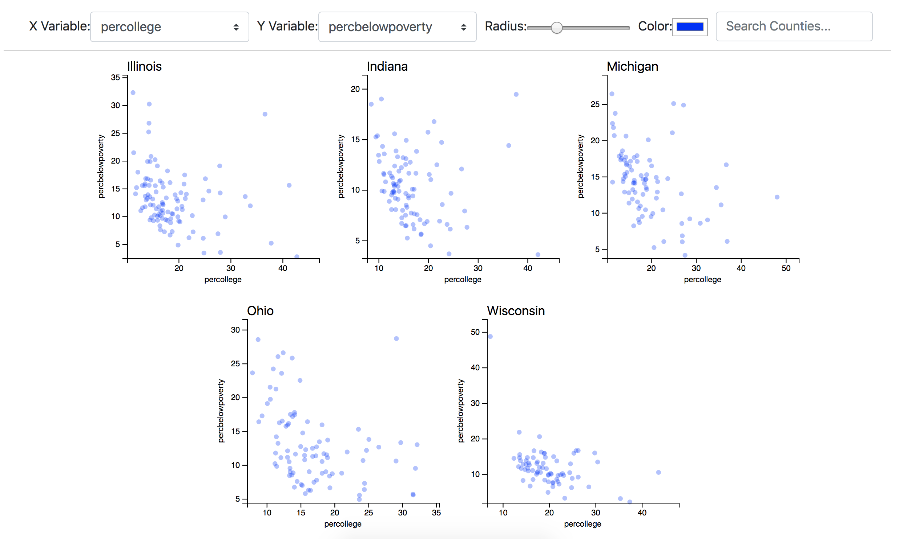

# 09-small-multiples

In this exercise, you'll follow the instructions below to create a small multiples visualization layout using React:

In doing so, you'll use `d3.nest()` to organize your data to pass to your `<ScatterPlot>` components. See the `App_solution.js` file for solutions.

## Instructions
The majority of the code has been written for this exercise. The core challenge of this exercise is to figure out the proper **data structure** for creating small multiples. More specifically, you'll create a `<Scatterplot>` component for each _state_ in the dataset. To do so, make the following changes in your `App.js` file.

### `render()` Method
As noted above, this exercise is really about getting the right _data structure_. Because the intention is to render a `<ScatterPlot>` component for each _state_ in the dataset, you'll need to create an array of data, one object for each state present. Luckily, the `d3.nest()` function is a direct solution to this challenge:

- **Create `nestedData`**: create a variable `nestedData` by using the `d3.nest()` method, indicating that the `key` for each group should be dictated by the `group` property. This is because in the `allData` array, the generic term `group` is used, rather than something specific to this dataset (like "`state`"). This should store an **array of objects**, each of which will have a _key_ (the state name), and a set of _values_ (the array of objects to be visualized in the scatter plot)
- **Return `<ScatterPlot>` Components**: at the end of your `return()` statement, you should iterate through your `nestedData` object, and return a `<ScatterPlot>` component in each iteration. When you return the `<ScatterPlot>`, you'll need to set the following _properties_:
  - `title`: the title for the chart (stored in the `.key` property of your iterant).
  - `xTitle`: a label for your x axis in the scatterplot. This will be the same for each plot, and is stored in `this.state.xVar`.
  - `yTitle`: a label for your y axis in the scatterplot. This will be the same for each plot, and is stored in `this.state.yVar`.
  - `radius`: a radius for each point, stored in `this.state.radius`.
  - `color`: the color for each point, stored in `this.state.color`.
  - `data`: the data for the plot, stored in the `.vales` property of your iterant. 
  - `key`: a unique key for the plot, so React can easily _diff_ the DOM. You could use the index of the iterant, or perhaps more appropriately, the `.key` property of your iterant. 
  