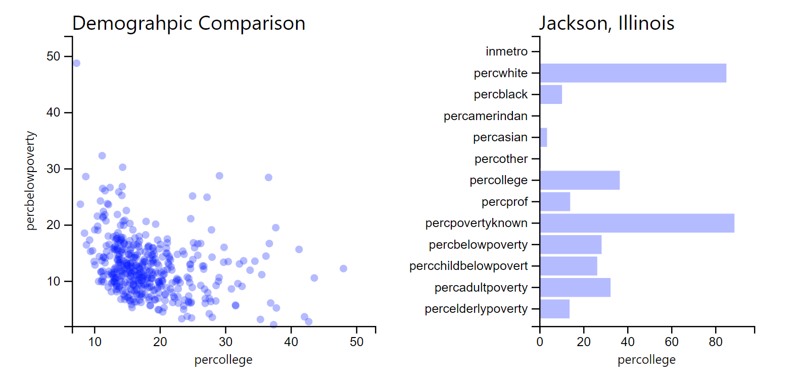

# 10-lifting-up-state-exercise

In this exercise, you'll follow the instructions below to **lift up state** in a React application, adding interactivity to the following charts:

In doing so, you'll use **pass functions as props** to your React components. See the `*_solution.js` files for solutions.

## Instructions
The majority of the code has been written for this exercise. The core challenge of this exercise is to figure out how to _pass functions as props_ so that you can _lift up state_. More specifically, you'll be able to **hover** on your scatterplot to change the selected county, or **click** on a row of your table to change the `y` axis. See below for the changes to make in each file.

### `<App>` Component
All changes to your application will be tracked in the **state** of your `<App>` component. This component will need methods to update its state (i.e., `this.updateXvar()`) so that they can be easily _passed to its child components_. Importantly, you'll need to **bind the scope** to each of these methods in the `constructor()` method. To achieve this, follow these steps:

- Create a new method `updateXvar()` for your component. It should take in a parameter (a _string_ of the new X variable to display), then update the state of `xVar` given that target's value. 
- Use the `updateXvar()` method in your `<select>` element for your X variable. You should still use an **anonymous arrow function** as the callback, in which you pass a parmaeter (i.e., `d`) to your `this.updateXvar()` function.
- Pass a prop `update` to your `<BarChart>` component: this property should be an **anonymous function** in which you call your `this.updateXvar()` method. 

Then, **repeat the above steps** for a method to select the _selected location_ shown in the bar chart. This method should control the state of the selected location (`this.state.selected`) by the _id_ of each point.

### `<BarChart>` Component
Your `<BarChart>` componet will accept as a prop an `update()` function. To use this to _lift up state_, do the following:

- Assign a `mouseover()` event to each bar that passes the value of the data point to the `this.props.update()` function.

### `<ScattterPlot>` Component
Your `<ScatterPlot>` componet will accept as a prop an `update()` function. To use this to _lift up state_, do the following:

- Assign a `mouseover()` event to each circle that passes the `id` of the data point to the `this.props.update()` function.